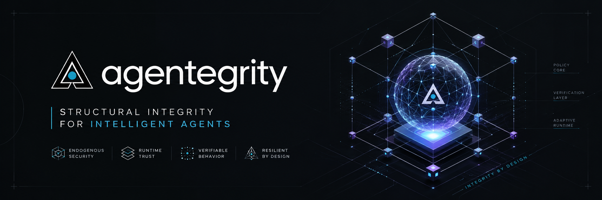

<p align="center">
  
</p>

<p align="center">
<a href="https://npmjs.com/package/@agentegrity/client"></a>
<a href="https://npmjs.com/package/@agentegrity/client"></a>
<a href="https://www.npmjs.com/org/agentegrity"></a>
<a href="https://pepy.tech/projects/agentegrity"></a>
<a href="https://deepwiki.com/Cogensec/agentegrity"></a>
<a href="https://opensource.org/licenses/Apache-2.0"></a>
<a href="https://www.python.org/downloads/"></a>
<a href="pyproject.toml"></a>
<a href="spec/SPECIFICATION.md"></a>
</p>

**Building AI agents capable of securing themselves.**

Every existing AI security tool builds protection that humans apply to agents from the outside. Guardrails filter inputs. Runtime monitors watch outputs. Policy engines enforce rules. These are necessary, and Agentegrity does not replace them. Agentegrity addresses a different question: how do you measure whether the agent itself has the structural integrity to remain coherent when those external controls cannot reach inside its decision process?

Agentegrity (agent + integrity) is the discipline of building AI agents that can defend themselves, stabilize themselves, and recover themselves, and then verifying that they actually can. This repository provides the open specification, the reference architecture, and a Python implementation for that verification.

## Documentation

**Full documentation lives in [`docs/`](docs/)**, published with Mintlify. Start here:

| | |
|---|---|
| [Introduction](docs/get-started/introduction.mdx) | What Agentegrity is, and why the composition layer |
| [Installation](docs/get-started/installation.mdx) | Extras, telemetry opt-out, verifying the install |
| [Quickstart](docs/get-started/quickstart.mdx) | Three-line instrumentation on any framework |
| [Your first attestation](docs/get-started/first-attestation.mdx) | Build, sign, and verify a chain end to end |
| [The four layers](docs/concepts/four-layers.mdx) | Adversarial, cortical, governance, recovery |
| [Limitations](docs/concepts/limitations.mdx) | Every published benchmark number, including the weak ones |
| [API reference](docs/api/overview.mdx) | The full Python surface |

## Install

```bash
pip install "agentegrity[claude]"          # Claude Agent SDK
pip install "agentegrity[langchain]"       # LangChain + LangGraph
pip install "agentegrity[openai-agents]"   # OpenAI Agents SDK
pip install "agentegrity[crewai]"          # CrewAI
pip install "agentegrity[google-adk]"      # Google Agent Development Kit
pip install "agentegrity[autogen]"         # Microsoft AutoGen
pip install "agentegrity[agno]"            # Agno
pip install "agentegrity[bedrock-agents]"  # AWS Bedrock Agents
```

Other extras: `[crypto]` (Ed25519 attestation signing), `[llm]` (Claude-backed semantic checks), `[otel]` (OpenTelemetry export), `[stats]`, `[kms]`, `[all]`. See [Installation](docs/get-started/installation.mdx).

```bash
python -m agentegrity          # version + installed adapters
python -m agentegrity doctor   # end-to-end self-check, prints composite score
```

## Instrument in three lines

```python
from claude_agent_sdk import ClaudeSDKClient, ClaudeAgentOptions
from agentegrity.claude import hooks, report

async with ClaudeSDKClient(options=ClaudeAgentOptions(hooks=hooks())) as sdk:
    await sdk.query("Summarize the latest LLM safety papers")
print(report())
```

Or let it detect the framework for you:

```python
import agentegrity

runtime = agentegrity.init()              # detect + attach
chain = runtime.instrument(my_chain)      # LangChain / LangGraph / Agno / Strands / ADK
chain.invoke({"input": "..."})
print(runtime.report())
agentegrity.shutdown()
```

TypeScript agents get the same 2-3 line DX from six npm packages. See [TypeScript](docs/typescript/overview.mdx).

## Supported frameworks

Fourteen zero-config adapters: the same instrumentation shape, the same evaluator pipeline, the same signed attestation chain.

<table>
  <tr>
    <td align="center" width="110">
      <a href="https://github.com/anthropics/claude-agent-sdk-python">
        <br/>
        <sub><b>Claude Agent SDK</b></sub>
      </a><br/><sub>Python · TS</sub>
    </td>
    <td align="center" width="110">
      <a href="https://github.com/langchain-ai/langchain">
        <br/>
        <sub><b>LangChain / LangGraph</b></sub>
      </a><br/><sub>Python · TS</sub>
    </td>
    <td align="center" width="110">
      <a href="https://github.com/openai/openai-agents-python">
        <br/>
        <sub><b>OpenAI Agents SDK</b></sub>
      </a><br/><sub>Python · TS</sub>
    </td>
    <td align="center" width="110">
      <a href="https://github.com/crewAIInc/crewAI">
        <br/>
        <sub><b>CrewAI</b></sub>
      </a><br/><sub>Python · TS</sub>
    </td>
    <td align="center" width="110">
      <a href="https://github.com/google/adk-python">
        <br/>
        <sub><b>Google ADK</b></sub>
      </a><br/><sub>Python · TS</sub>
    </td>
  </tr>
  <tr>
    <td align="center" width="110">
      <a href="https://github.com/microsoft/autogen">
        <br/>
        <sub><b>AutoGen</b></sub>
      </a><br/><sub>Python</sub>
    </td>
    <td align="center" width="110">
      <a href="https://github.com/agno-agi/agno">
        <br/>
        <sub><b>Agno</b></sub>
      </a><br/><sub>Python</sub>
    </td>
    <td align="center" width="110">
      <a href="https://github.com/awslabs">
        <br/>
        <sub><b>AWS Bedrock Agents</b></sub>
      </a><br/><sub>Python</sub>
    </td>
    <td align="center" width="110">
      <a href="https://github.com/vercel/ai">
        <br/>
        <sub><b>Vercel AI SDK</b></sub>
      </a><br/><sub>TypeScript</sub>
    </td>
    <td align="center" width="110"></td>
  </tr>
</table>

<sub>All product names, logos, and brands are property of their respective owners and are used for identification purposes only. Use does not imply endorsement.</sub>

Per-adapter guides, including which ones can actually enforce, are in [Frameworks](docs/frameworks/overview.mdx).

## The four layers

```
┌─────────────────────────────────────────────┐
│            RECOVERY LAYER                   │
│   Compromise detection · Continuity ·       │
│   Sustained-degradation tracking            │
├─────────────────────────────────────────────┤
│           GOVERNANCE LAYER                  │
│   Policy enforcement · Human oversight ·    │
│   Compliance mapping · Audit trails         │
├─────────────────────────────────────────────┤
│            CORTICAL LAYER                   │
│   Reasoning consistency · Memory checks ·   │
│   Behavioral baselines · Drift detection    │
├─────────────────────────────────────────────┤
│           ADVERSARIAL LAYER                 │
│   Attack surface mapping · Threat           │
│   detection · Coherence scoring             │
└─────────────────────────────────────────────┘
```

The **Adversarial Layer** verifies self-defense by mapping the agent's attack surface and detecting threats across input channels. The **Cortical Layer** verifies self-stability by monitoring reasoning consistency, memory integrity, and behavioral drift from baseline. The **Governance Layer** enforces organizational policy and produces audit trails. The **Recovery Layer** verifies self-recovery by tracking chain continuity, watching score history for sustained degradation, and confirming the agent declares the recovery capabilities it claims.

## What this is not

It is not a guardrail. It does not block agent actions on its own: when an action is blocked, that is the result of explicit governance policy, not inferred risk. It is not a runtime enforcement layer competing with WAF-style products. It is not a hosted service. It is a measurement and verification library, and everything it does is in service of producing evidence that an agent has (or lacks) the structural properties of a self-securing system.

The detection numbers, including the weak ones, are published in [STATUS.md](STATUS.md) and explained in [Limitations](docs/concepts/limitations.mdx). The regex tier scores 1.000 TPR / 0.000 FPR on InjecAgent (N=2,108) but was calibrated on that suite, so read it as in-distribution recall; on AgentDojo's goal-text projection it scores 0.286 TPR / 0.113 FPR, which regex cannot close because separating an injected goal from a legitimate user task requires session context, not content patterns.

## Telemetry

Anonymous, shape-only usage analytics are on by default: adapter names, enum values, counts, and rounded scores. Never prompts, model inputs or outputs, tool arguments, file paths, or agent names. Nothing is sent on import.

```bash
export DO_NOT_TRACK=1                      # the cross-tool standard, or:
export AGENTEGRITY_TELEMETRY_DISABLED=1    # agentegrity-specific
```

Every event is documented in [Telemetry](docs/export/telemetry.mdx), and all payload construction is auditable in one file: [`_telemetry_props.py`](src/agentegrity/core/_telemetry_props.py).

## Project documents

| Document | Description |
|---|---|
| [Manifesto](MANIFESTO.md) | The founding statement of agentegrity as a discipline |
| [Specification](spec/SPECIFICATION.md) | Properties, layers, controls, scoring, conformance levels |
| [Threat model](spec/threat-model.md) | STRIDE against the framework itself, with mitigations |
| [Glossary](agentegrity-glossary.md) | Vocabulary of the discipline, defined precisely |
| [Status](STATUS.md) | What is hardened, reference, experimental, or planned |
| [Changelog](CHANGELOG.md) | Release history, including breaking changes and migrations |
| [Security policy](SECURITY.md) | Reporting a vulnerability |

## Design principles

1. **Self-securing capability is the goal. Verification is the methodology.** Without the underlying capability, the score is theater. Without the verification methodology, the capability is unprovable. Both are required.

2. **Composition layer, not model layer.** Better base models do not eliminate the need for agent-level verification. They make compositions more capable and therefore more dangerous when compromised.

3. **Defense-in-depth, not defense-in-replacement.** Guardrails, runtime monitors, and network controls remain essential. Agentegrity adds a layer inside the agent's decision process where exogenous controls cannot reach.

4. **Cryptographic, not observational.** "We monitored the agent and it looked fine" is not assurance. Attestation records are signed, chained, and independently verifiable.

5. **Open standard, plural implementations.** The specification is open and the reference implementation is Apache 2.0. A single-vendor standard isn't a standard.

6. **Honest about limitations.** Every claim is defensible in writing. The worst possible outcome is a published benchmark showing our claims are louder than our implementation. We avoid that by being the first to name limitations.

## Contributing

We welcome contributions. See [CONTRIBUTING.md](CONTRIBUTING.md).

Priority areas:
- Additional framework adapters (Microsoft Agent Framework, covering Semantic Kernel)
- Compliance report generation beyond EU AI Act / NIST AI RMF
- Domain-specific validator libraries (healthcare, finance, embodied)
- Language ports (Go, Rust)
- Formal verification of layer interactions
- Cross-framework session merging (multiple adapters sharing one attestation chain)

## Citation

```bibtex
@misc{agentegrity2026,
  title={The Agentegrity Framework: Building and Verifying Self-Securing Autonomous AI Agents},
  author={Cogensec Research},
  year={2026},
  url={https://github.com/cogensec/agentegrity}
}
```

## License

Apache License 2.0. See [LICENSE](LICENSE).

---

**Agentegrity is a Cogensec Research initiative.** The discipline is open. The framework is open. The code is open. We invite researchers, practitioners, and organizations building or deploying autonomous AI agents to adopt, implement, extend, and critique it.
